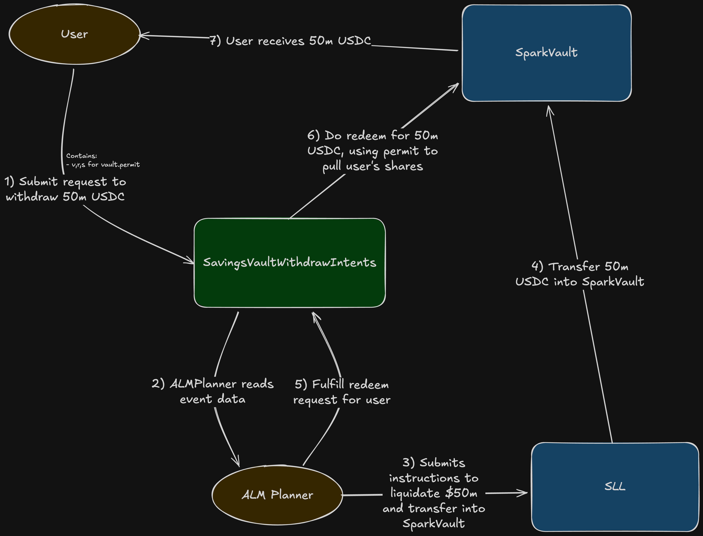

# Spark Savings Vault Intents

<!--  -->
<!-- [![Foundry][foundry-badge]][foundry] -->
<!-- [](https://github.com/{org}/{repo}/blob/master/LICENSE) -->

[foundry]: https://getfoundry.sh/
[foundry-badge]: https://img.shields.io/badge/Built%20with-Foundry-FFDB1C.svg

## Overview

Spark Liquidity Intents is a system designed to handle large liquidity operations across Spark protocol. It consists of two components: **Borrow Intents** and **Savings Intents**. This repository contains the **Savings Intent** contract (`SavingsVaultIntents`).

### Problem

Spark Savings Vaults are ERC-4626 vaults where users deposit assets and receive vault shares. When users want to withdraw -especially large amounts -the vault may not hold enough idle liquidity to process the redemption immediately. A direct on-chain `redeem` call would simply revert, leaving the user unable to exit their position.

### Solution

The Savings Intent contract introduces an **intent-based withdrawal mechanism**. Instead of redeeming directly from the vault, users submit a withdrawal intent (an on-chain request) specifying how many shares they want to redeem, who should receive the underlying assets, and a deadline. The **ALM Planner** (an off-chain relayer system) monitors these intents, orchestrates the necessary liquidity (e.g., unwinding positions and transferring assets into the vault), and then calls the contract to atomically fulfill the redemption. This ensures that large withdrawals can be processed reliably without requiring the vault to hold excess idle capital at all times.

## Architecture

The system involves three actors:

| Actor | Role |
|---|---|
| **User** | Holds vault shares and submits withdrawal intent requests |
| **SavingsVaultIntents Contract** | Stores withdrawal requests and executes atomic redemptions on fulfillment |
| **ALM Planner (Relayer)** | Off-chain system that monitors intent events, orchestrates vault liquidity, and calls `fulfill` |

### User Flow

> **Note:** The diagram below is from an earlier design iteration and will be replaced. The current implementation uses a simple ERC-20 `approve` instead of permit signatures.



**Step-by-step flow (current implementation):**

1. **Approve shares** -User approves the SavingsVaultIntents contract to spend their vault shares via `vault.approve(intentContract, shares)`.
2. **Create request** -User calls `request(vault, shares, recipient, deadline)` on the intent contract. The contract validates all preconditions and stores the `WithdrawRequest`.
3. **Event emitted** -A `RequestCreated` event is emitted containing the account, vault, requestId, shares, recipient, and deadline.
4. **Liquidity orchestration** -The ALM Planner monitors `RequestCreated` events. It orchestrates the required liquidity by instructing asset liquidation and transferring the proceeds into the Spark Vault so it has enough idle assets to cover the redemption.
5. **Fulfill request** -The ALM Planner calls `fulfill(account, vault, requestId)` on the intent contract.
6. **Atomic redemption** -The contract deletes the stored request and calls `vault.redeem(shares, recipient, account)`, redeeming on behalf of the user using their share allowance and sending the underlying assets directly to the recipient. The intent contract never holds any shares or assets.
7. **User receives assets** -The user (or specified recipient) receives the underlying assets in their wallet.

## Functionality

### User Operations

#### Creating a Request

A user calls `request(vault, shares, recipient, deadline)` to create a withdrawal intent. The function returns a unique `requestId` (auto-incrementing per vault). The request is stored in the contract's `withdrawRequests` mapping, keyed by `account → vault → WithdrawRequest`.

#### Multiple Vaults

A user can have **one active request per vault** simultaneously. Since requests are keyed by `(account, vault)`, a user can hold separate active requests across different vaults (e.g., one for USDC vault and one for ETH vault) without interference.

#### Overwriting a Request

If a user calls `request()` for a vault where they already have an active request, the new request **overwrites** the previous one. A new `requestId` is assigned from the vault's incrementing counter. The old request is silently replaced.

#### Cancelling a Request

A user can cancel their pending request by calling `cancel(vault)`. This deletes the stored request and emits a `RequestCancelled` event with the cancelled `requestId`. Cancelling a request for a vault with no active request reverts.

### Fulfillment (Relayer)

The `fulfill(account, vault, requestId)` function is restricted to accounts with the `RELAYER` role (the Spark ALM Planner). When called, it:

1. Loads the stored `WithdrawRequest` for the given account and vault
2. Validates that the request exists and the provided `requestId` matches the stored one (race condition protection -see [Security](#security-considerations))
3. Validates that the deadline has not been exceeded
4. Deletes the stored request
5. Calls `vault.redeem(shares, recipient, account)` -redeeming the user's shares on their behalf (using the share allowance) and sending the underlying assets directly to the specified recipient

The fulfillment is **atomic**: the intent contract never holds any shares or assets at any point during execution.

### Request Creation Preconditions

The `request()` function enforces the following checks. All must pass for a request to be created:

| Check | Condition | Error |
|---|---|---|
| Vault whitelisted | Vault must be in the whitelist | `VaultNotWhitelisted` |
| Valid recipient | Recipient must not be `address(0)` | `InvalidRecipientAddress` |
| Min intent assets | `convertToAssets(shares) >= minIntentAssets` | `IntentAssetsBelowMin` |
| Max intent assets | `convertToAssets(shares) <= maxIntentAssets` | `IntentAssetsAboveMax` |
| Valid deadline | `block.timestamp < deadline <= block.timestamp + maxDeadline` | `InvalidDeadline` |
| Sufficient shares | `vault.balanceOf(user) >= shares` | `InsufficientShares` |
| Sufficient allowance | `vault.allowance(user, intentContract) >= shares` | `InsufficientAllowance` |

## Roles & Access Control

The contract uses OpenZeppelin's `AccessControlEnumerable` with two roles:

### DEFAULT_ADMIN_ROLE

The admin can perform the following configuration operations:

- **`setMaxDeadline(uint256 maxDeadline_)`** -Updates the maximum allowed deadline duration. The deadline for any request must be at most `block.timestamp + maxDeadline` into the future. Cannot be set to zero.

- **`updateVaultConfig(address vault, bool whitelisted, uint256 minIntentAssets, uint256 maxIntentAssets)`** -Configures a vault's whitelist status and intent amount bounds. The `minIntentAssets` must be strictly less than `maxIntentAssets`. These bounds define the acceptable range for the underlying asset value of requested shares.
  - The min/max intent asset bounds exist because the intent system is designed to serve **large withdrawals** from Spark Savings Vaults. In production, these thresholds will be set to high values (e.g., millions of USDC) to ensure the system is used for its intended purpose.

### RELAYER

The relayer (Spark ALM Planner) has a single capability:

- **`fulfill(address account, address vault, uint256 requestId)`** -Execute the atomic withdrawal fulfillment for a user's pending request.

## Security Considerations

This section is intended for auditors and security researchers reviewing the `SavingsVaultIntents` contract.

### Trust Assumptions

- **Admin** is trusted and expected to validate actions before performing them (e.g., verifying vault addresses and reasonable intent bounds before calling `updateVaultConfig`).
- **Relayer / ALM Planner** is **not** assumed to be non-malicious. However, even a malicious relayer cannot cause fund loss or break the contract. The worst a relayer can do is fail to fulfill requests or let them expire. All funds remain safely in the vault under the user's control until a valid `fulfill` is executed.

### Key Invariants

- **Atomic fulfillment** -The intent contract never holds any shares or assets at any point. Fulfillment calls `vault.redeem(shares, recipient, account)` directly, redeeming on behalf of the user and sending assets straight to the recipient.
- **Vault compatibility** -Whitelisted vaults will be Spark Vault v2. The intent contract is designed to be fully compatible with the Spark Vault v2 implementation.

### Expected Behaviors

- **Request overwrite is by design.** When a user creates a new request for a vault where they already have an active request, the old request is silently replaced. This is intentional and not a vulnerability.
- **Relayer fulfills promptly.** The ALM Planner is expected to fulfill valid requests as soon as liquidity is available.

### Known Edge Cases & Mitigations

#### 1. Post-Request Allowance/Balance Revocation

A user can revoke their share allowance or transfer shares away after successfully creating a request. This would make the request unfulfillable -the `redeem` call during `fulfill` would revert due to insufficient allowance or balance.

**Mitigation:** The ALM Planner is functionally intelligent and will detect such invalid requests off-chain, avoiding wasted gas on doomed `fulfill` calls. Even if the planner did attempt fulfillment, the transaction would simply revert with no adverse effects.

The high `minIntentAssets` threshold makes spamming (creating requests then revoking) economically impractical -the user would need to hold a significant amount of vault shares. There is no upside for attackers performing this kind of spam.

#### 2. Stale Min/Max Asset Checks

The `request()` function checks that the asset value of the requested shares falls within `[minIntentAssets, maxIntentAssets]` at request creation time. By the time the relayer calls `fulfill`, the asset value may have changed because Spark Vault share prices grow over time (the price per share is deterministic and always increases).

**Why this is acceptable:**
- The price change between request creation and fulfillment is very small in practice.
- The share price only grows, so the asset value at fulfillment will be equal to or slightly higher than at request time.
- Re-checking min/max bounds during `fulfill` is intentionally omitted to avoid unnecessary complexity.
- This only matters for requests created at the exact boundary values.

#### 3. Race Condition: Cancel/Overwrite + Stale Fulfill

A race condition can occur when a user modifies their request while the relayer is about to fulfill the old one:

**Scenario:**
1. User creates request A with `requestId = 1` for their full share balance.
2. User cancels request A (or overwrites it by creating a new request).
3. User creates request B with `requestId = 2` for half their shares.
4. The relayer, which captured request A's event, attempts to call `fulfill(user, vault, 1)`.

Without protection, the relayer could accidentally fulfill request B using request A's stale `requestId`, potentially redeeming a different number of shares than the user currently intends.

**Mitigation:** The `fulfill()` function takes `requestId` as a parameter and checks that `request_.requestId == requestId`. This ensures the relayer can only fulfill the exact request it intends to:

1. User creates request A (`requestId = 1`) for full shares
2. User cancels request A
3. User creates request B (`requestId = 2`) for half shares
4. Relayer calls `fulfill(user, vault, 1)` → **reverts** with `RequestNotFound` because stored `requestId` is `2`, not `1`
5. Relayer picks up request B and calls `fulfill(user, vault, 2)` → **succeeds**

This `requestId` matching mechanism prevents any race condition between user actions and relayer fulfillment.

## Usage

```bash
forge build
```

## Test

```bash
forge test
```

***
*The IP in this repository was assigned to Mars SPC Limited in respect of the MarsOne SP*
